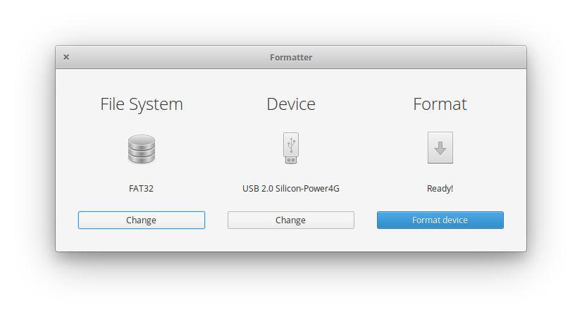

# Formatter

### A simple formatter designed for [elementary OS](https://elementary.io/)

You'll need the following dependencies for build:
* cmake
* cmake-elementary
* debhelper
* libgranite-dev
* valac

#### Donations:

Please donate to bitcoin address:

1JUJ3qjEoNCRQ9hvDtXZyuDdrSgrmpkDBS

